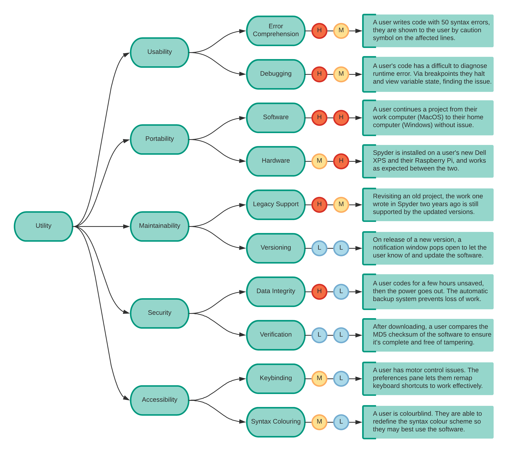

## Milestone 2

### Group Members
1. Arman Yousef Zadeh Shooshtari
2. Anna Olkhovskaia
3. Zoë Henderson
4. Alex Deweert
5. Nitika Jindal

### Architecturally Significant Requirements

1. Upon closing the Spyder IDE, the user’s work must be saved at least once. In the event of a system or software crash, saved versions of the most recently changed documents can be restored from an automatic backup, so the Spyder IDE must backup unsaved files at regular intervals.

2. The Spyder IDE should be able to show syntactic errors in a way that the programmer can easily understand the cause of the error.

3. Spyder must be able to run on different operating systems.

4. Spyder must be able to support most recent versions of Python.

5. Spyder should be able to run on a wide variety of hardware.

6. A little description of the different tools should be available within the Spyder IDE so that there is no need to constantly reference the documentation to use them.  Functionality should be apparent to an experienced user at a glance.

7. Updates to the Spyder IDE should allow previous Spyder project compatibility assuming that the project is reasonably recent.

8. The downloading and installing process of the Spyder IDE must be made user-friendly.

9. Spyder must capture and handle user program or Spyder tool failures by generating comprehensive bug, error, and exception reports

10. Spyder must draw graphs, diagrams, and execute code with low latency.

11. A user must be able to easily debug and trace their code in the Spyder IDE using debugging, tracing, and breakpoint tools.

12. Spyder must regularly check for new updates and inform the users when new versions are released.

13. A code-completion aid feature similar to Microsoft IntelliSense should available as a tool in Spyder IDE.

### Quality Attribute Scenarios
<table>
  <tr>
    <th>Quality Attributes</th>
    <th>Attribute Refinement</th>
    <th>Scenarios</th>
  </tr>
  <tr>
    <td>Performance</td>
    <td>Runtime latency</td>
    <td>A user wishes to graph a three-dimensional dataset at the Large Hadron Collider based on particle acceleration and collision. Since these datasets are notoriously very large, the user is skeptical that the graph will render quickly, but is happy to discover that data processing and rendering is relatively fast (H M).</td>
  </tr>
  <tr>
    <td rowspan="2">Maintainability</td>
    <td>Legacy support</td>
    <td>A user is looking to spruce up their resume, they open a project they wrote in Spyder 2 years ago, the project is still supported by the updated versions (H L).</td>
  </tr>
  <tr>
    <td>Versioning</td>
    <td>A new version of Spyder is released, it automatically pops open a window letting the user know of the update, the user can then click on the window for an automatic update of the IDE (M L).</td>
  </tr>

  <tr>
      <td>Security</td>
      <td>Data Integrity</td>
      <td>A user works on a large piece of code for an hour having saved once at the beginning, the power goes out and the user attempts to recover lost work. The user finds that 98% of their code is still available due to the automatic backup system (H L).</td>
  </tr>
  <tr>
    <td rowspan="4">Usability</td>
    <td>Syntax error comprehension</td>
    <td>A user writes code that has > 50 syntax errors, the errors are shown to the user by caution symbol on the affected lines so they can easily identify their errors (H M).</td>
  </tr>
  <tr>
      <td>Runtime error comprehension</td>
      <td>A new user unfamiliar with python is experimenting with their code, upon running it the IDE comprehensive informs them of the errors in such a way that they can easily trace their errors (H M).</td>
  </tr>
  <tr>
    <td>Debugging and tracing</td>
    <td>A developer is creating a complex program that has a difficult runtime error. The user is unable to find the error by simply tracing the code, so the user adds a breakpoint so that execution is halted, and the variable states can be examined. The user easily determines how the values of the variables are changing in the flow of the code which causes the runtime error (H M).</td>
  </tr>
  <tr>
    <td>Template based completion</td>
    <td>A developer is writing many classes with similarly structure code, each of which will require customized tweaks based on a boilerplate style of initial design, but cannot be compressed into a single class. To save time, the user presses a combination of keys to activate the code-completion feature and is able to select from a saved list of code template (H H).</td>
  </tr>

  <tr>
    <td rowspan="2">Accessibility</td>
    <td>Syntax Colouring</td>
    <td>A user is colorblind. Spyder supports changing syntax highlighting to a user-defined color palette (M L).</td>
  </tr>
  <tr>
    <td>Key Mapping</td>
    <td>A user has motor control issues. Spyder supports remapping keyboard shortcuts, which can act as an aid for some people (M L).</td>
  </tr>
</table>

### Utility Tree

[Left side: business importance. Right side: technical difficulty]

### Quality Attribute Scenarios in Template Form
|Aspect|Details|
|------|-------|
|Scencario Name|Low latency Dataset Graphing|
|Business Goals|“...the Spyder contributor community desires to provide the best Scientific Python Development Environment possible”|
|Quality Attribute|Performance|
|Source|Any Spyder use who invokes a rendering module|
|Stimulus|Graphing a large dataset|
|Response|Spyder graphs the dataset with minimal latency|
|Response Measure|Time|

|Aspect|Details|
|------|-------|
|Scenario Name|Code-completion aid feature|
|Business Goals|“...contributors likely desire to create a safe, convenient, and user-friendly development environment for Python developers”|
|Quality Attribute|Usability|
|Source|Any Spyder user who activates code completion feature|
|Stimulus|Repetition of well-known coding conventions|
|Response|The output code of the code completion feature|
|Response Measure|The desired code templates are inserted as expected|

|Aspect|Details|
|------|-------|
|Scenario Name|Runtime error|
|Business Goals|“...contributors likely desire to create a safe, convenient, and user-friendly development environment for Python developers”|
|Quality Attribute|Usability|
|Source|The Spyder IDE Python runtime module|
|Stimulus|Runtime error|
|Response|Halting of execution lets the user trace the code so variable states can be examined|
|Response Measure|How easy and clear is for a developer to debug the code and find the cause of the runtime error|
