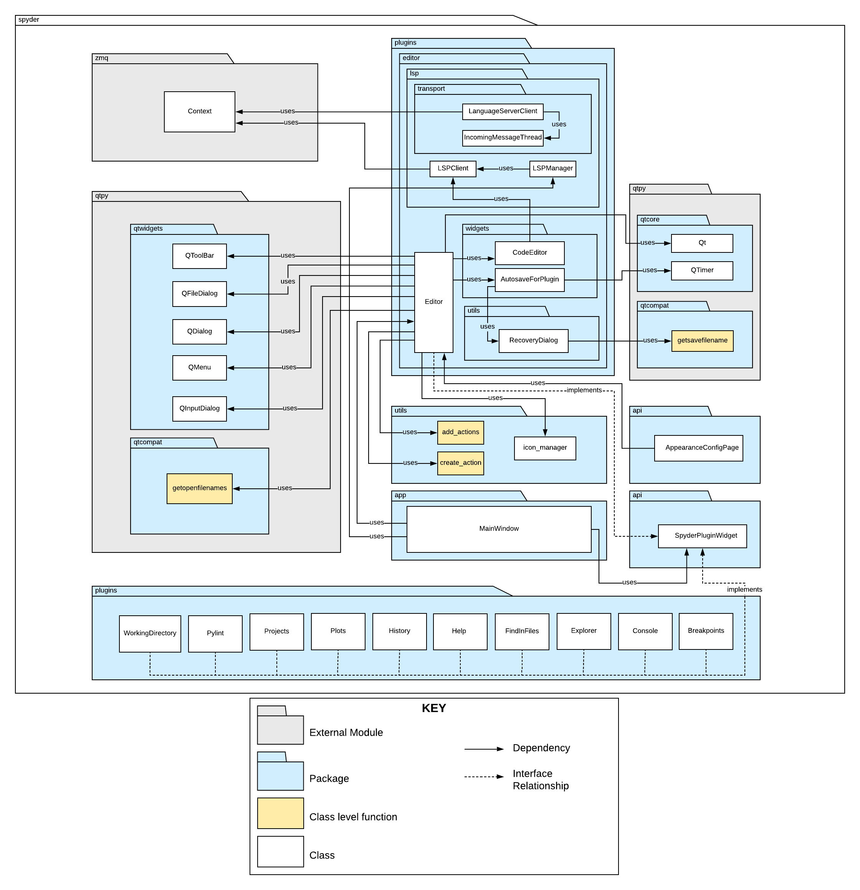
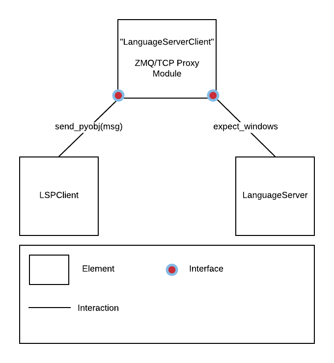
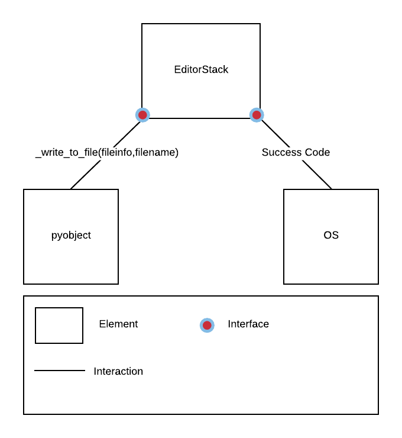
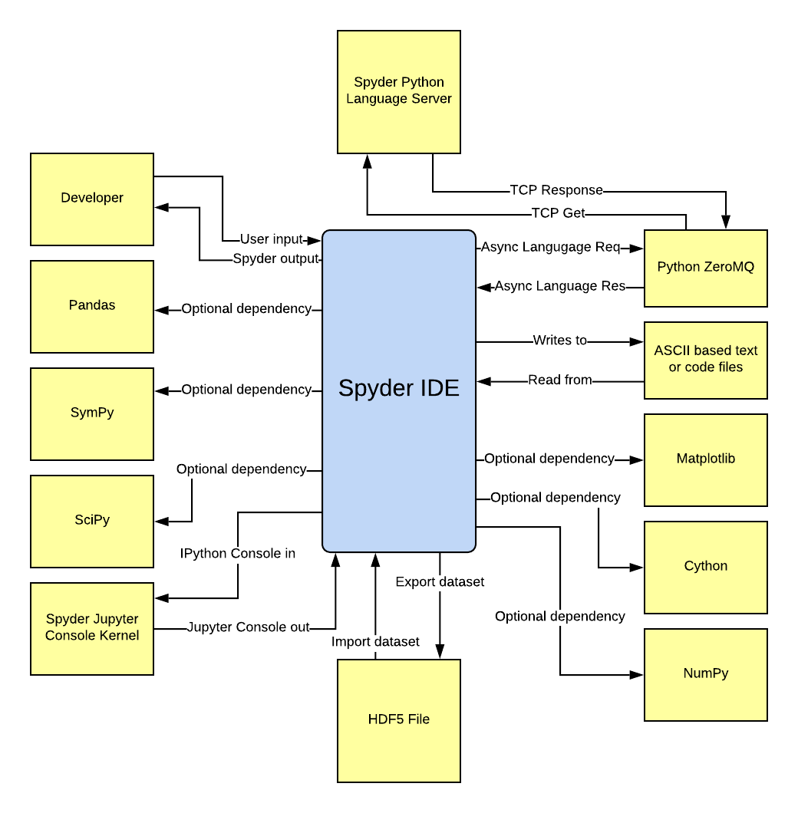
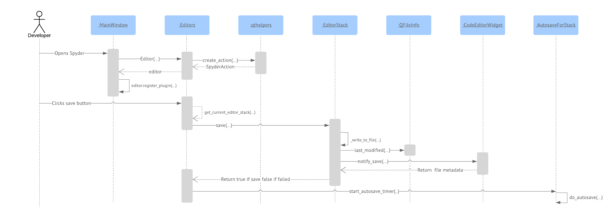
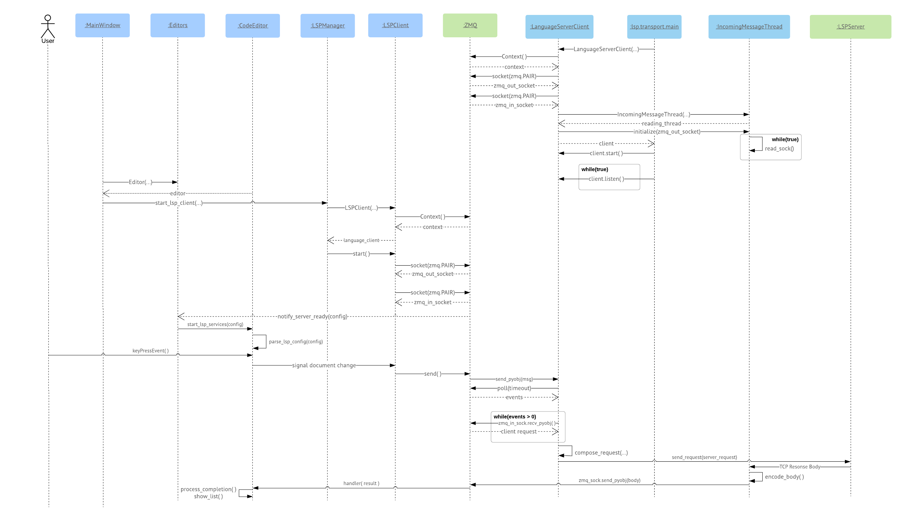

# Milestone 3

## Group Members
1. Arman Yousef Zadeh Shooshtari
2. Anna Olkhovskaia
3. Zoë Henderson
4. Alex Deweert
5. Nitika Jindal

## Module View

## Table Of Contents

 1. Primary Presentation
 2. Element Catalogue
 3. Element Interface   
 		3.1 Interface Identity  
 		3.2 Resources Provided  
 		3.3 Locally defined data types  
 		3.4 Error handling  
 		3.5 Variability provided  
 		3.6 Quality attribute characteristics  
 		3.7 What the element requires  
 		3.8 Rationale and design issues  
 		3.9 Usage guide
 4. Element Interface   
 		4.1 Interface Identity  
 		4.2 Resources Provided  
 		4.3 Locally defined data types  
 		4.4 Error handling  
 		4.5 Variability provided  
 		4.6 Quality attribute characteristics  
 		4.7 What the element requires  
 		4.8 Rationale and design issues  
 		4.9 Usage guide
 5. Context Diagram
 6. Sequence Diagram for QAS1
 7. Sequence Diagram for QAS2
 8. Rationale

## Primary Presentation
This view implements the "uses" style of module views. Here we present the overall architecture of the Spyder IDE with a focus on three specific aspects of the architecture which highlight its plugin widget system for extensibility, and two quality attribute scenarios from Milestone 2.

And the scenarios are: 

1. A developer is writing many classes with similarly structure code, each of which will require customized tweaks based on a boilerplate style of initial design, but cannot be compressed into a single class. To save time, the user presses a combination of keys to activate the code-completion feature and is able to select from a saved list of code template. (Intellisense). 

2. A user works on a large piece of code for an hour having saved once at the beginning, the power goes out and the user attempts to recover his/her lost work. The user finds that 98% of their code is still available due to the automatic backup system. 
        
<p align = "center">

<br>
Figure 1: Primary Presentation
</p>

## Element Catalogue
### spyder
Spyder is the main outer package which contains all the business logic for the Spyder IDE project. Almost all of the important logic with respect to the functionality of the entire IDE is contained in this package. It is an all-encompassing package at the root level of the project which includes version control, scripting, and continuous integration packages as well. It provides functionality such as opening, editing, and saving files which contain code or text.

### spyder.plugins 
The plugins package contains the code for plugin modules which are appended to the primary spyder base code. Spyder works on the basis of adding plugins for additional IDE functionality, which is good design since it keeps the code modular and extensible.  These plugins include such modules as editor, console, breakpoints, explorer, etc. For example, the editor is the window where one would write code. The console would be a docked or floating window where one would see program output from the stdout or stderr output streams.

### spyder.plugins.editor
This is a package which contains the editor plugin. The editor is the main window within which a developer would edit code. The package also contains the code for the editor API itself, which would allow outside modules to communicate with an editor object or to call editor functions.

### spyder.plugins.editor.Editor
This is a class within the plugin.py file that contains most of the base logic for an editor widget. This class also contains the functions that handle file autosaving for both individual editors and stacks of editors.

### spyder.plugins.editor.utils
This is a package which contains the code for utilities for the editor plugin. For example, autosave, debugging, folding, etc. This package also contains testing for these utilities as well as the code for initialization. 

### spyder.plugins.editor.lsp
This package contains all of the code that handles the spyder Language Server Protocol client implementations. This also includes the ZMQ/TCP proxy classes (under the transport package) which act as an intermediary between the Spyder LSPClient and the LanguageServerClient.

### spyder.plugins.editor.lsp.LSPClient
This class acts as a client for communication with the LanguageServerClient via ZMQ and implements the calls and procedures required to communicate with a v3.0 Language Server Protocol server (via ZMQ).

### spyder.plugins.editor.lsp.LSPManager
This class manages all LSPClients connected to language servers defined in the preferences of the Spyder project.

### spyder.plugins.editor.lsp.transport
This package contains the implementation code for the ZMQ/TCP proxy classes which are run independently from the main Spyder program.

### spyder.plugins.editor.lsp.transport.main
This module isn’t a class, rather it acts as an entry point for the ZMQ/Proxy system, initializing a LanguageServerClient and, by extension the requisite ZMQ incoming and outgoing ports for communication with LSPClients.

### spyder.plugins.editor.lsp.transport.LanguageServerClient 
This class handles incoming requests from the actual Spyder LSP client ZMQ queue, encapsulates them into valid JSONRPC messages and sends them to an LSP server via TCP.

### spyder.plugins.editor.lsp.transport.IncomingMessageThread 
This class handles and processes incoming TCP messages sent by a Language Server Protocol server, then it relays the information to the actual Spyder LSP client via ZMQ.

### zmq
ZeroMQ is a high-performance asynchronous messaging library, aimed at use in distributed or concurrent applications. Spyder uses ZMQ for communication with a ZMQ/TCP proxy system which relays requests to a Language Server (via TCP) in order to facilitate Intellisense like functionality such as code completion, code insights, and definitions.

### zmq.Context
Contexts help manage any sockets that are created as well as the number of threads ZeroMQ uses behind the scenes. ZMQ handles the creation and destruction of sockets when processes are started and terminated. Contexts can be shared between threads and, in fact, are the only ZeroMQ objects that can safely do this.

### spyder.plugins.editor.utils.AutosaveForPlugin
This is a component of the editor plugin which implements autosaving functionality. The autosaving feature is based on a timer, which is set by the user. 

### spyder.utils
Contains miscellaneous utilities like thread managers for non GUI blocking long processes, version control system assistant functions, syntax highlighting, icon managers.

### spyder.utils.create_action
A class level function that allows developers to create actions such as save, save as open, revert, and so forth. These actions are registered during the main program initialization by both the Spyder main IDE plugins and widgets.

### spyder.utils.add_actions
A class level function that is utilized by an instance of qtpy widgets; for example, this function adds created actions to a QMenu or a QToolBar.

### spyder.utils.icon_manager
A set of class level definitions which contain metadata for icon files for the aesthetics of the Spyder IDE.

### app.MainWindow
The main window which is initialized after one starts the program. Is responsible for loading all initial external modules, displaying the splash screen, populates the main window toolbars by creating and registering actions, saving the state of current sessions, restoring the state from previous sessions, etc.

### spyder.api.SpyderPluginWidget
An interface for which all plugin widgets must inherit and re-implement its interface. Basically, any class which is a plugin and a widget must inherit this interface which will enforce a specific behavior required by any plugin widget by higher level controllers. For example, console, editor, explorer, help, history are utilized by the AppearanceConfigPage class in order to apply appearance schemes to all plugin widgets. This keeps the basic required behavior and properties for all plugin widgets at the same level. In another example, upon initialization, each widget must return all of its possible menu actions, such as save, save as, and revert to the main window.

### spyder.preferences.AppearanceConfigPage
Applies appearance settings including font and color schemes to every plugin widget. This includes the editor. This class initializes all widgets using a common interface enforced method called apply_plugin_settings().

### spyder.plugins.editor.widgets.RecoveryDialog
A dialog window for recovering files from the autosave feature. This class gathers data about which files may be recovered. This data is saved within the program folder as a file of tuples, each pair of which contains data from the original saved file and the autosaved file.

### qtpy
qtpy is an abstraction layer that lets developers write applications using a single API. It provides support for PyQt5, PyQt4, and PySide using the PyQt5 layout, which is a high-level API that allows developers to interact with desktop-based features such as Bluetooth, NFC, but most importantly, traditional user interface development. Basically, you write your code as if you were using PyQt5 but import qt from qtpy instead of PyQt5.

### qtwidgets
The qtwidgets module contains classes that provide a set of user interface elements to create desktop-based user interfaces. It can be used as a container for other widgets, and it can be subclassed to create custom widgets. qtwidgets can be nested within other qtwidgets.

### qtwidgets.QToolBar
The QToolBar class provides a movable panel that contains a set of controls. Toolbar buttons are added by adding actions, using addAction or insertAction. A widget can be inserted instead of a toolbar if the button is not appropriate.

### qtwidgets.QFileDialog
The QFileDialog class provides a dialog that allows users to select files or directories. This class allows a user to navigate the file system in order to select one, many files, or a directory. With the use of static functions, we can create a QFileDialog.

### qtwidgets.QDialog
The QDialog class is the base class of dialog windows. A dialog window is a top-level window mostly used for short-term tasks and brief communications with the user. This class can provide a return value, and they can have default buttons. A dialog's default button is the button that's pressed when the user hits Enter. This button is used to signify that the user accepts the dialog's settings and wants to close the dialog. 

### qtwidgets.QMenu
The QMenu class provides a menu widget for use in menu bars, context menus, and other popup menus. A menu widget is a selection menu which can be either a pull-down menu in a menu bar or a standalone context menu.

### qtwidgets.QInputDialog
The QInputDialog class provides a simple dialog to obtain individual values from a user. The input value may be strings, numbers, or items from a list. For the convenience of the users, a label may be set which maps to the value they have entered. 

### qtpy.qtcompat
This class provides compatibility wrappers for critical functionality that differs across Qt versions. For example, between Qt4 and Qt5 there may have been many classes and class members that are obsolete. 

### qtcompat.getopenfilenames
Under qtcompat, there are many class level functions with names which match the classes that provide compatibility functions. This class is one of these functions. The purpose is to retrieve filenames of files that are currently open and being used.

### qtcompat.getsavefilename
This is a static convenience function that will return a file name selected by the user. The file does not have to exist. It creates a modal file dialog with the given parent widget. For example, the RecoveryDialog class utilizes this method as a result of being called by the autosave plugin.

### qtpy.qtcore.QTimer
This class provides a higher level programming interface for a timer for the application which imports it. The QTimer class provides a single shot and repetitive timer functionality.

## Element Interface
<p align = "center">

<br>
Figure 2: Interface for ZMQ/TCP Proxy Module
</p>

An interface is a boundary across which two independent entities meet and interact or communicate with each other.

### Interface Identity
This means giving a meaningful name to the interface in a context that explains exactly what the interface does. This interface is called the "ZMQ/TCP Proxy Module". It is a small collection of two classes working together under one controller, acting independently of the Spyder main code.

### Resources Provided
A set of resources that the element provides to its actors

#### Resource Syntax
1. msg = {'id': self.request_seq, 'method': method,'params': params}
2. zmq_out_socket.send_pyobj(msg)

#### Resource Semantics
1. msg creates a Python JSON formatted data structure containing the method request name, the Id parameter is is a numeric value to keep track of the total language server requests, and the params parameter which is an additional JSON python object populated with different parameters depending on an external element that makes use of the interface.
   
2. The zmq_out_socket is a ZMQ socket object which has bound to it as send_pyobj function. That function takes the msg parameter and serializes it using pickle. The interface requires this resource to be serialized since it is a JSON data structure, that it will later convert and re-send via TCP.

#### Resource Usage Restrictions
This section defines the circumstances under which the resource may be used.
The resources provided to the ZMQ/TCP Proxy Module must include all parameters including Id, Method, and the nested params object. In addition, this resource cannot be used until it broadcasts a SERVER READY signal, indicating that a language request can be made.

### Locally defined data types
There are no data types not natively supported by Python that are required to use this resource. Python natively supports JSON style objects. The resource itself converts these datatypes to serialized Python objects using Python Pickle.

### Error handling
Errors are handled by Python try-except. ZMQ sockets handle errors by converting error messages with zmq_sterror() to meaningly error strings passed into the current environment.

### Variability provided
This section highlights how the interface may allow the element to be configured in some way. zmq_setsockopt() allows configurations to be viewed and set. They act in a similar way to settings typical TCP sockets.

### Quality attribute characteristics
The architect needs to document what quality attribute characteristics the interface makes known to the element’s users. Here we have the QAS under usability being made visible to the element's users, which use it indirectly. The element provides indirect access to code completion functionality.

### What the element requires
In this section, we highlight what the element requires that may be specific, named resources provided by other elements. External language server must be initialized, and it required that the parameters specified in the above sections be passed in exactly as noted. The element itself requires a developer to specify its network and port addresses for TCP, as well as the ZMQ in and out ports. In terms of data input to the element, the element can act asynchronously so it can be accessed simultaneously by multiple external elements.

### Rationale and design issues
For this section, the rationale should explain the motivation behind the design. The decision to utilize this style to create the ZMQ/TCP Proxy Module was to take advantage of the caching style necessary to facilitate voluminous amounts of data coming in from many potential sources (other elements within Spyder who want to make language requests). The ZMQ portion of the element provides a queue of requests so that the TCP portion can handle as fast as it can. Since ZMQ requests are so much faster than TCP, a queue within this element is necessary to cache buffered language requests as necessary.

### Usage guide
The language server should already be initialized, it is an external resource.<br>
Here we initialize the ZMQ/TCP Proxy Module (can be from main)
```
client = LanguageServerClient(host=args.server_host,
                                  port=args.server_port,
                                  workspace=args.folder,
                                  zmq_in_port=args.zmq_in_port,
                                  zmq_out_port=args.zmq_out_port,
                                  use_external_server=args.external_server,
                                  server=args.server,
                                  server_args=unknownargs)
    client.start()
    try:
        while True:
            client.listen()
    except TerminateSignal:
        pass
    client.stop()
```
Calls to the ZMQ/TCP Proxy Module can be made like:
```
msg = {
            'id': self.request_seq,
            'method': method,
            'params': params
        }
        if requires_response:
            self.req_status[self.request_seq] = method

        logger.debug('{} request: {}'.format(self.language, method))
        self.zmq_out_socket.send_pyobj(msg)
```

## Element Interface
<p align = "center">

<br>
Figure 3: Interface for EditorStack file saving module
</p>

An interface is a boundary across which two independent entities meet and interact or communicate with each other.

### Interface Identity
EditorStack is the module which facilitates communication between Spyder and the host machine. Specifically, writing to a file and receiving a success or error code.

### Resources Provided
A python object which contains data to be written to a file, or a code which indicates success or failure to Spyder.

#### Resource Syntax
1. self._write_to_file(finfo, finfo.filename)

#### Resource Semantics
1. finfo contains the actual information which is to be written to the filesystem. Filename contains the metadata that will be contained in the file written out.
   
2. The response code from the operating system from which the file is written will be interpreted by Python as a success or failure depending on the code received, and an exception will be thrown as appropriate.

#### Resource Usage Restrictions
This section defines the circumstances under which the resource may be used.
From the client portion (Spyder) there must exist changes to a file that can be written to the file system. For the second client to use the resource it simply has to be running (Spyder) and it has to have been preceded by a file write request in order to make a request to the Spyder program.

### Locally defined data types
Spyder fileinfo (which contains python objects and metadata) is the only locally defined datatype required for this interface.

### Error handling
Errors are handled by Python try-except. Attempting to write to a file that cannot be opened by the second client (the host machine) will result in the return of the requisite error code which will trigger an exception in Python, handled as an EnvironmentError.

### Variability provided
This section highlights how the interface may allow the element to be configured in some way. There is no specific variability to the file to be written out except for the contents in the python byte object, and the filename which will be created or written to by the host machine.

### Quality attribute characteristics
The architect needs to document what quality attribute characteristics the interface makes known to the element’s users. Autosaving was deemed to be an important feature for the Spyder IDE. Aside from the _write_to_file function, there is nothing else made apparent to the elements users.

### What the element requires
This element requires data from the file to be written to, which include changes byte data that reflects changes made to the file in the Editor stack, a file name (and other metadata) and it needs a response code from the host machine.

### Rationale and design issues
The design of this interface seems to be a standard design pattern for writing to and receiving responses from host machines as necessary. There aren't many design issues to consider other than how the interface handles errors from both clients ends. For example, if an illegal filename is provided, or how to handle not enough memory errors (on disk). The Spyder interface, EditorStack, surrounds its actions with try except and shows a dialog to the end user should an error occur, indicating what the problem was. or the host machine (the secondary client) there are no design issues to consider aside from how the interface is designed to write data, which is controlled via system API dependent on the host machine.

### Usage guide
```
        try:
            self._write_to_file(finfo, finfo.filename)
            ...
        except EnvironmentError as error:
            self.msgbox = QMessageBox(
                    QMessageBox.Critical,
                    _("Save Error"),
                    _("<b>Unable to save file '%s'</b>"
                      "<br><br>Error message:<br>%s"
                      ) % (osp.basename(finfo.filename),
                                        str(error)),
                    parent=self)
```


## Context Diagram
This view shows how the Spyder IDE interacts with its external environment. Note the external libraries that are optional, but could be imported by a Spyder user to add plotting functionality. In addition, Spyder utilizes both ascii based file input and output, as well as the popular HDF5 file format more suited to large numerical datasets. We also show the interaction with Spyder and it's end users, as well as Jupyter console input and output. Finally, this view highlights how Spyder meets one of the QAS where a user has access to Code Completion behavior in the Spyder editor window, and how this feature is facilitated by an external highspeed ZMQ messaging system as a proxy to an external Language Server via TCP.<br>

<p align = "center">

<br>
Figure 4: Context Diagram
</p>

## Sequence Diagram for QAS1
The following diagram outlines how the Spyder IDE achieves the requirements in the QAS for the IDE autosaving system:<br>
*A user works on a large piece of code for an hour having saved once at the beginning, the power goes out and the user attempts to recover lost work. The user finds that 98% of their code is still available due to the automatic backup system (H L).*

<p align = "center">

<br>
Figure 5: Sequence Diagram for Autosave
</p>


## Sequence Diagram for QAS2
The following diagram outlines how the Spyder IDE achieves the requirements in the QAS for the IDE CodeCompletion system:<br>
*A developer is writing many classes with similarly structured code, each of which will require customized tweaks based on a boilerplate style of initial design but cannot be compressed into a single class. To save time, the user presses a combination of keys to activate the code-completion feature and is able to select from a saved list of code templates (H H).*

<p align = "center">

<br>
Figure 6: Sequence Diagram for Code Completion
</p>

## Rationale
The Spyder Integrated Development Environment (Spyder) appears to have been designed with extensibility in mind. Every feature available to a developer in Spyder is implemented as a plugin. These plugins are divided in such a way that there is a clear distinction between the responsibility of each feature. There is a central module which handles initialization of all primary plugins. Any plugin that is to be made part of Spyder must implement a plugin interface so that any such plugin can be easily integrated by the central module. The benefit of dividing these plugins by functionality, but forcing them to implement an interface, is that developers do not need to concern themselves with the constraint that alteration of one plugin, or the central code, will negatively affect the behavior of the system, so long as the set of inputs and outputs (based on the standards established by interface functions) is adhered to.

Spyder also utilizes client-server architecture in order to provide services common to many development environments. Specifically, the ability to recognize syntax, code insights, and look up definitions. The client-server architecture is a software design pattern in which the server hosts, supplies, and manages most of a client's resources and services. The client-server architecture was used here specifically to maintain both modularity, in the sense that the Language Server Protocol features and functionality remain outside of the primary code base, and usability, in the form of speed due to the concurrency of an asynchronous messaging library and queue-based interface system. The modular approach allows external language clients to be switched out, as well as the interface (the ZMQ/TCP Proxy module) between the Spyder client and the language server itself.

For one of our quality attribute scenarios, we highlighted the use of the ZMQ which is a high performance messaging library and Language Server Protocol (LSP) which allows the Microsoft Intellisense feature to be present in the Spyder IDE. The Spyder IDE acts as a client and communicates with an LSP server through a ZMQ/TCP proxy system. The ZMQ/TCP proxy system code is contained within the Spyder IDE codebase, but it is executed independently from the main Spyder IDE MainWindow and CodeEditor. Here we have a client-server style of communication taking place between two or more modules, but acting independently with minimal coupling due to the highly modular plugin system.

Spyder is a perfect example of the benefits of modular software design. If, at some point in the future, the Spyder Development community decides to alter the code editor so that it uses a faster communication protocol, either in its ZMQ/TCP proxy, or in its LSPClient, minimal changes are required in either the central code, or any other plugins that make use of the Language Server as well. This, of course, is not limited to just the CodeEditor and the Language Server. The debugger, help system, console, linting system, and many others are all implemented using the plugin system, all of which implement the plugin interface.
