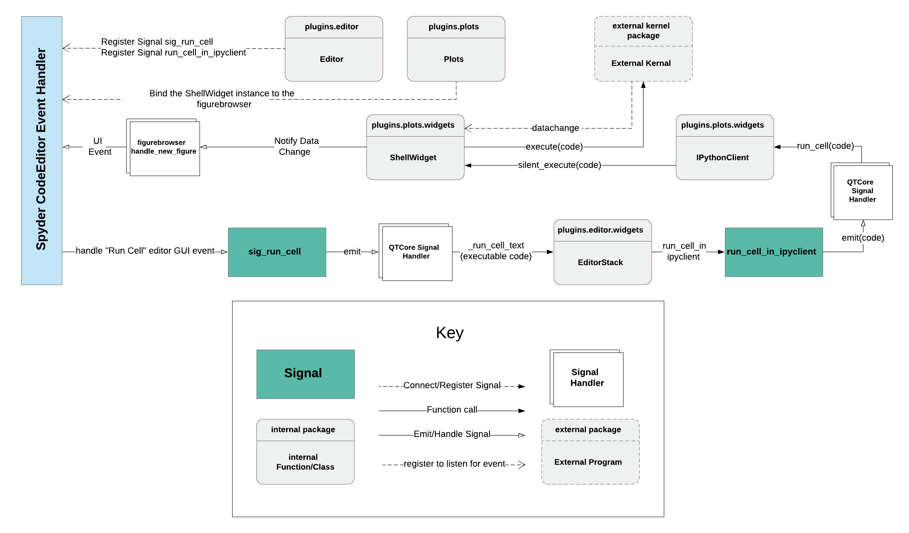
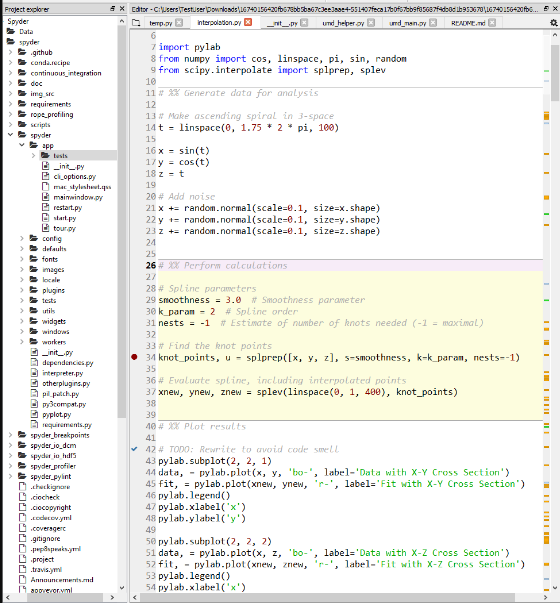
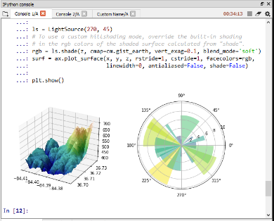
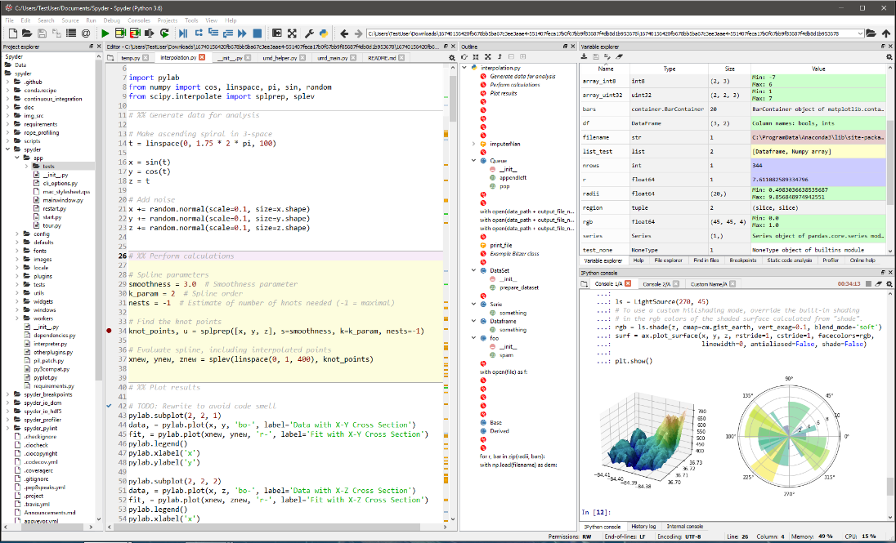
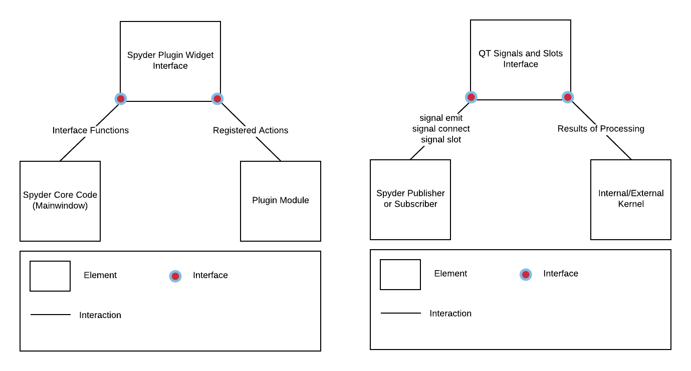
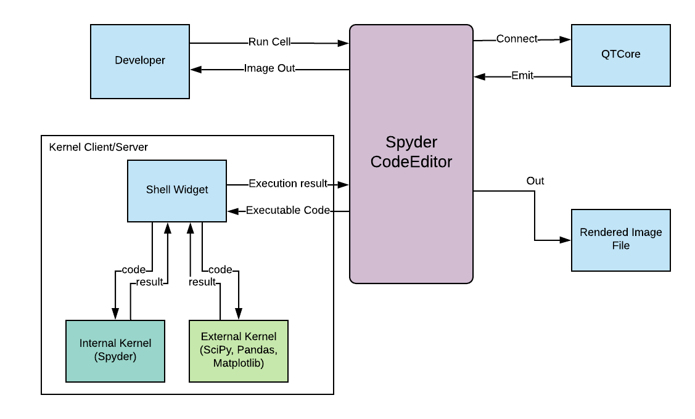
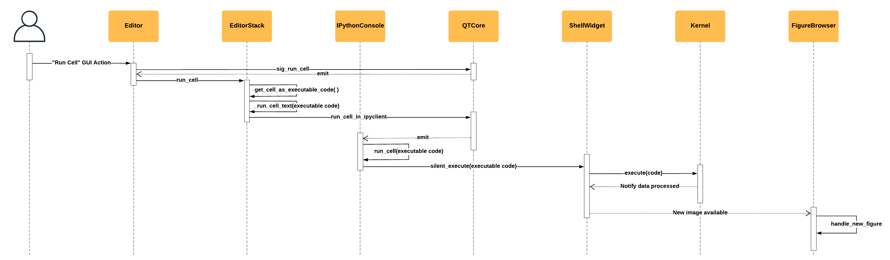

# Milestone 4

## Group Members
1. Arman Yousef Zadeh Shooshtari
2. Anna Olkhovskaia
3. Zoë Henderson
4. Alex Deweert
5. Nitika Jindal

## Component and Connector View

 1. Primary Presentation
 2. Element Catalogue
 3. Element Interface   
         3.1 Interface Identity  
         3.2 Resources Provided  
         3.3 Locally defined data types  
         3.4 Error handling  
         3.5 Variability provided  
         3.6 Quality attribute characteristics  
         3.7 What the element requires  
         3.8 Rationale and design issues  
         3.9 Usage guide
 4. Element Interface   
         4.1 Interface Identity  
         4.2 Resources Provided  
         4.3 Locally defined data types  
         4.4 Error handling  
         4.5 Variability provided  
         4.6 Quality attribute characteristics  
         4.7 What the element requires  
         4.8 Rationale and design issues  
         4.9 Usage guide
 5. Context Diagram
 6. Variability Guide 
 7. Behavior Diagram
 8. Rationale

## Primary Presentation
        
<p align = "center">

<br>
Figure 1: Primary Presentation
</p>

## Element Catalogue

### Spyder Code Editor
The Spyder CodeEditor is a child to the parent module, Editor, which is more of a manager class for EditorStack objects (similar to an editor tab in your favorite IDE) which themselves contain CodeEditor objects. However, the CodeEditor's themselves utilize FigureBrowser class in order to display the results of code cells executed from within either the CodeEditor or an attached ShellWidget.

### plugins.editor.Editor
The plugins.editor.Editor registers the signal at the start of the event causing a chain reaction. The editor registers sig_run_cell as well as the _run_cell_in_ipyclient signals making a connection with them. 

### plugins.plots.Plots
This class binds the ShellWidget to the figurebrowser class, because of this, whenever the ShellWidget notifies the figurebrowser about the data change, the figurebrowser class automatically display that change. 

### Run Cell (GUI event)
"Run Cell" is the GUI event which gets called whenever the user clicks on the run cell button which is present in the UI, presses the F5 key, or clicks the context menu item "Run Cell" in order to execute the written code. The result of this event is that a signal object emits (publishes) an event to its connected functions, triggering a chain of events eventually culminating in the render and display of a graph from the internal/external kernel should an image result from that execution.

### sig_run_cell
This is a QTCore Signal object which is initialized during registration of a CodeEditor object which is initialized by an EditorStack parent class, which in turn is managed and initialized by a parent Editor object. The Editor object, during initial program startup, causes the sig_run_cell signal object to become connected to functions which trigger a series of other signals (emits/publishing actions) to eventually execute a code cell.


### QTCore emit
Emit is a function of the QTCore package which broadcasts a signal to any functions connected to it. The connected functions listen (subscribe) to incoming signals and become activated when a signal emit is heard.

### QTCore Signal

QtCore.Signal() is a resource provided by the QTCore signaling interface which facilitates asynchronous communication between thinly connected signals and functions. Such functions may be anonymous, and many such functions can be connected to one signal object. For example, one such signal handler is a QTcore signal object which is connected to the Signal emit function _run_cell_text. Every signal may be attached to a connected function run_cell_copde, and there can be multiple connected functions acting as multiple listeners. This particular one is calling a function run cell.

### _run_cell_text
The _run_cell_text function in the editor is connected to sig_run_cell signal within the editor stack. This function is a chain of function calls formatting the code into an executable format.

### plugins.editor.widgets.EditorStack
_run_cell_in_ipyclient is the function in run cell text which is in the Editor stack. It calls the _run_cell_in_ipyclient which created a chain of events creating the signal. It's an editor window and editor stack has a code window. Editor stacks have code editors. Each editor stack contains a code editor. Each code editor stack has a code editor which has a code which is known as the cell. The Cell can run, either the full code or just a part of it. 

<p align = "center">

<br>
Figure 2: Editor Stack
</p>

### run_cell_in_ipyclient
Editor stack calls the function run_cell_in_ipyclient, it emits another signal which is the run_cell function in IPythonClient. This function is another step in the chain of commands triggered by the original GUI run cell broadcast.

### run_cell_in_ipyclient
This is a signal emitted by the Editor stack. Run_cell_in_ipyclient is another QTcore signal. This has a connected function and an emit function, the emit function is a qtcore function which is attached to the qtcore signal object.

This is a QTCore signal which is emitted by the editor stack and run_cell_in_ipyclient function. It has a connected function and an emit function, the emit function is a QTCore function which is attached to the qtcore signal object. 

### plugins.plots.widgets.IPythonClient
IPythonClient stands for interactive python client and is also an instantiated member of each shell widget. The IPythonClient class forms a point of communication with either internal or external kernels which execute formatted code taken from either the code editor or the shell widget code cells.

### run_cell 
A function of the IPythonClient. Another step in passing executable code down from the initial emitted broadcast due to a GUI event that in turn will trigger the silent_execute function within IPythonClient as well.

### silent_execute
The result of calling IPythonClient's run_cell command also results in this function being called, taking executable code from the source of a GUI event in which a user triggers "run cel", and finally forwarding that code to either an internal or external kernel which will evaluate the code and return a result.

### plugins.plots.widgets.ShellWidget
The shell widget can be observed in the following diagram (figure 3) as a tab labeled (for example) as "Console 1/A", "Console 2/A" etc. This is essentially a console instance embedded within a code editor. The ShellWidget contains an instantiation of an IPythonConsole which acts as a client for communication with an internal or external kernel. For the purposes of the Component and Connector view, the ShellWidget in this use case is one of the last few endpoints of execution as a result of a Signal emit broadcast that was triggered by a user clicking a GUI option essentially attempting to run a code cell.

The executable code passed down from the events prior to this will be sent to CodeWidget and which will send the executable code to the external kernel for processing and interpretation. The image below is a slightly outdated version of Spyder taken from the project website. The image shown is actually the FeatureBrowser element, now partially separated out from the ShellWidget itself. 

<p align = "center">

<br>
Figure 3: Shell Widget 
</p>

### External Kernal
This encompasses any qualifying external modules with a kernel such as Matplotlib, Pandas or SciPy. The kernel must notify the Shellwidget and figure browser of the results of any code execution.

### Notify Data Change
A generalized label provided to any event which is emitted as a result of execution from an external kernel.

For the purpose of this view, the data change is an event caused by the external kernel causing a notification to be made available to ShellWidget, FigureBrowser, or any other listening widgets.

### figurebrowser handle_new_figure
The Notify data change which we got from the ShellWidget class will be passed to this signal handler Which will emit a UI event to the spyder CodeEditor. Figure browser is the class which, and handle_new_figure is the function that deals with changes broadcasted by the internal/external kernel.

### UI Event
Any event which triggers the user interface of Spyder to become changed in some way. In this particular case, the UI event is caused first by a user clicking Run Cell, culminating in a series of broadcasts and functions calls, leading to the rendering of an image on the FigureBrowser.

<p align = "center">

<br>
Figure 4: Sypder IDE 
</p>

## Element Interface
<p align = "center">

<br>
Figure 5: Interfaces for the Plugin Widget and Publisher Subscriber functionality
</p>

An interface is a boundary across which two independent entities meet and interact or communicate with each other.

## QT Signals and Slots Interface

### Interface Identity
QtCore.SIGNAL() and QtCore.SLOT() macros allow Python to interface with Qt signal and slot delivery mechanisms. 
### Resources Provided
1. Signal(void) or Signal(object)
2. Connect(function)
3. Emit(void) or Emit(object)
4. Slot(void) or Slot(params)
#### Resource Syntax
Emit
```
# Run actions
        self.run_cell_action = create_action(
            self, _("Run cell"), icon=ima.icon('run_cell'),
            shortcut=QKeySequence(RUN_CELL_SHORTCUT),
            triggered=self.sig_run_cell.emit)
```
Signal
```
sig_run_cell = Signal()
```
Connect
```
editor.sig_run_cell.connect(self.run_cell)
```
Slot
```
    @Slot(str, dict)
    def handle_response(self, method, params):
        if method in self.handler_registry:
            handler_name = self.handler_registry[method]
            handler = getattr(self, handler_name)
            handler(params)
            # This signal is only used on tests.
            # It could be used to track and profile LSP diagnostics.
            self.lsp_response_signal.emit(method, params)
```
#### Resource Semantics
Signal is an interface that is provided by the QTCore library utilized by Spyder. It provides Emit which is a broadcast to any classes which have connected functions. These classes listen for emits which cause functions to be executed.
Emit is simply a broadcast function that causes connection functions to fire.
Slot is an annotation that can be provided to functions that allow emits to fire with/without connecting them first.
Connecting is a way to call functions using emit signals without using the Slot annotation.

#### Resource Usage Restrictions
The signals and slots interface provides an intermediate set of functions which facilitate publishers and subscribers within Spyder.
1. Signal is a constructor for a Signals and Slots Interface object.
2. Connect takes a callback function that will run only when a publisher received an emitted signal from a subscriber.
3. Emit allows a publisher to broadcast a signal to any connected or slotted class functions within Python.
4. Slot provides an ability to annotate multiple functions which, when connected to a Signal object, may optionally receive emissions that contain Python data objects.
#### Error Handling
Any of the functions provided by the interface cannot be used within the try and catch statements. Doing so will cause an error itself. For errors to be handled, QTApplication must be subclassed and the code tried and caught there. Exceptions are not thrown in the typical sense by QT. Instead, error codes are used. Error codes will propagate if there is not a connected function (or set of connected functions) if the connected function itself causes erroneous behavior or slot code does not exist.
### Locally defined data types
There are no explicitly defined local datatypes made in order to utilize this interface. A python data object is can be any data type which can be emitted and received by a publisher/subscriber pair. These include serialized first-class functions (functions that can be treated like objects, including anonymous functions), primitive data types, and data structures like arrays and dictionaries.
### Variability provided
It would be possible to implement one's own version of a publisher and subscriber system. This may or may not be faster than the current solution which is asynchronous and apparently robust. In terms of whether or not a publisher-subscriber system might be replaced with another design pattern, it seems that the model view controller could possibly be used for this specific example. In addition, it might be less subject to the confusing code, resulting in a more maintainable project. Publisher and subscriber can result in sometimes hard to trace listens and broadcasts.
### Quality attribute characteristics
This interface lends itself to the quality attribute where the user executes code and can see their graph quite quickly. Signals and emissions facilitate asynchronous communication between classes with connected functions, and thus, communication between the Spyder figure browser, and any code that is executed by an internal or external kernel.
### What the element requires
The element requires functions and defined signals. These functions can be both pre-defined or anonymous.
### Rationale and design issues
As mentioned in variability, it is possible that the use of signals and connected functions for the publisher and subscriber model could lead to difficult to trace or debug code. Since one emit can potentially trigger one or more function calls, it may be hard to trace behavior should a bug arise.
### Usage guide
A user wishes to facilitate communication between the two classes. One or more functions are defined in class A. In class B, a signal object is created and connected to the functions previously defined in class A. In future, the signal object is "emitted" which then calls any connected functions.

---

 ## Spyder Plugin Widget Interface

### Interface Identity
A Spyder Plugin Widget Interface allows a user to input value or performs a function. Widgets enhance user interaction with the IPython notebook.

### Resources Provided
1. get_plugin_title(): Return plugin title.
2. get_plugin_icon(): Return plugin icon (QIcon instance).
3. get_focus_widget(): Return the widget to give focus to. This is applied when plugin's dockwidget is raised on top-level.
1. closing_plugin(): Perform actions before the parent main window is closed. Return True or False whether the plugin may be closed immediately or not.
2. refresh_plugin(): Refreshes the widget
3. get_plugin_actions(): Return a list of QAction's related to plugin. Note: These actions will be shown in the plugins Options menu.
4. on_first_registration(): Action to be performed on first plugin registration.
5. register_plugin(): Register plugin in Spyder's main window.
6. update_font(): This must be reimplemented by plugins that need to adjust their fonts.
7.  apply_plugin_settings(): What to do to apply configuration plugin settings.

#### Resource Syntax
```
    def get_plugin_title(self): ...
    def get_plugin_icon(self): ...
    def get_focus_widget(self): ...
    def closing_plugin(self, cancelable=False): ...
    def refresh_plugin(self): ...
    def get_plugin_actions(self): ...
    def register_plugin(self): ...
    def on_first_registration(self): ...
    def apply_plugin_settings(self, options): ...
    def update_font(self): ...
    def check_compatibility(self): ...
```

#### Resource Semantics
The resources provided by the SpyderPluginWidget interface are quite self-explanatory. Each of the required functions allows the Spyder mainwindow to initialize each plugin, and apply settings as necessary to all widgets in a similar way. In the case of the CodeEditor which contains the ShellWidget, FigureBrowser, and IPythonClient widgets, a universal interface is necessary to keep all of the instances of these objects accessible and variable in the same way. That is, changes to the Spyder IDE must be reflected in all attached modules.
#### Resource Usage Restrictions
The only restriction is that this resource must be implemented by any plugin module to be implemented within Spyder.
### Locally defined data types
There are no locally defined custom datatypes to mention in order to utilize this resource.
### Error handling
The error handling required when utilizing this resource is just typical Python try excepts. The actual error handling will differ from plugin to plugin.
### Variability provided
There isn't a lot of room for variability when utilizing this interface. Changing the enforced function declarations would require a developer to change every other plugin that implements the SpyderPlyginWidget interface as well. This is prohibitive due to the time required unless the interface change is quite trivial. From the extensibility and modularity perspective, this interface allows variability in other ways. However, from a core architecture standpoint, the interface explicitly prohibits variation outside of what is required.
### Quality attribute characteristics
This interface is directly related to many quality attribute characteristics mentioned in this project, but specifically, it facilitates the integration of a code browser, together with a console widget with internal or external kernels to execute code cells, and an image browser to view the results of such code execution should a kernel produce an image.
### What the element requires
The element simply requires a plugin to be implemented in the correct way, "using" the interface means implementing its enforced functions. From the perspective of both elements which use the interface, one must implement, and one must utilize. So the interface element simply requires co-operation.
### Rationale and design issues
As mentioned in variability, the interface is restrictive in one way, but also provides extensibility in another. This style of design certainly lends itself to easy contribution from many sources and coding styles; perfect for an open source community driven project.
## Context Diagram
Here we see a very simple context diagram which highlights how the Spyder CodeEditor communicates with outside modules in order to interpret a user action in the GUI, resulting in a signal broadcast firing off a chain of events, eventually resulting in an image rendered to the FigureBrowser attached to the CodeEditor window.
<p align = "center">

<br>
Figure 6: Context Diagram
</p>

## Variability Guide
The publisher and subscriber model is one that could easily be replaced with a variation to achieve the same rendering result at a similar rate. In addition, it might be better-structured code as well. As previously noted, the signals and listeners style of architecture, in this case, is quite prone to unreadable code and difficult to trace bugs and errors. In terms of performance, as long as the signals connected functions are structured well, and they themselves do not cause blocking behavior, then the overall behavior of Spyder will be quite fast at rendering images as a result of code execution, given the asynchronous nature of the QTCore signal library.

The rendering speed of images also heavily relies upon the kernel within which the code cell is interpreted/executed. Here we have quite a lot of flexibility in terms of what kinds of code might be run by Spyder, and at what speed. This, of course, is facilitated by the SpyderPluginWidget interface which allows different plugins and modules to be used very easily, further increasing variability.

It would seem that the codebase for Spyder can be easily used on many operating systems, not aimed at a specific one. However, there are pieces which account for specific operating system requirements such as "NT" assuming that most modern Windows systems are nicknamed NT by the Spyder Developers. This actually makes sense since most popular Windows releases are in fact "NT" releases. In any case, Spyder is compatible across Windows, MacOS, and Linux. So in terms of external variability, there is no issue here.

In terms of hardware variability, the rendering of complex graphs may depend on the speed of various hardware. This would depend mostly on CPU utilization, but it some cases, depending on the type of external kernel used to interpret use code, dedicated graphics hardware might come into play. There is a lot of flexibility when it comes to how Spyder will behave in various hardware, combined with whatever external kernel is used as well.

## Behavior Diagram
The following diagram outlines how the Spyder IDE achieves the requirements in the QAS for the Low Latency Dataset Graphing: <br>
*A user wishes to graph a three-dimensional dataset at the Large Hadron Collider based on particle acceleration and collision. Since these datasets are notoriously very large, the user is skeptical that the graph will render quickly, but is happy to discover that data processing and rendering is relatively fast (H M).*

<p align = "center">

<br>
Figure 7: M4 Behavior Diagram
</p>

## Rationale
The developers of Spyder seemed to have chosen the Publisher-Subscriber model in order to display results of code cell execution to its users. We believe that this was due in large part to the modular nature of the program; the code cells can be executed from many locations, which all emit (publish) the same signal in order to trigger functions across many co-operating modules. As more modules get added to the code codebase, triggering the execution of code cells may require the results of the execution to be available in many locations, and in an asynchronous way. A potentially large code cell may be executed, but the users of the program do not want the GUI to be blocked by synchronous execution. The publisher-subscriber model, while not a necessity for this case, turned out to be a good design decision. However, there may be complications in the future of the program due to the potential for "spaghetti" code which is part of the issue in the publisher-subscriber model. Due to the thin coupling of emitted signals and their (potentially multiple) connected functions, such a design pattern might be difficult to debug should issues arise. In addition, maintainers and future developers may have a difficult time figuring out what published emissions cause what behavior and when.

Although there are some potential issues with this particular style of publisher-subscriber implementation, it would seem that the underlying model which provides the cell-execution-and-results-display (like a rendered graph), can be easily replaced by a faster or more robust implementation. Indeed, the SpyderPluginWidget interface which provides communication between Spyder and any plugin module extensions such as the CodeEditor or ShellWidget sub-module plugin might be replaced should the current model prove too complicated or result in erroneous behavior.

A lower level analysis of the code which implements the run-code-to-rendered-image functionality, there seem to be issues with complexity, and poor variable naming. In many cases, there are functions named exactly the same thing which pass the formatted executable code along with a chain resulting from the initial broadcast of the GUI event (Run Cell) in question. In addition, the use of anonymous functions was utilized to trigger some events in the chain of execution as well. While we support the utilization of most features within a programming language, the use of anonymous functions is not always necessary. In this case, a combination of poor function naming and inappropriate use of a random anonymous lambda function nested within a complex chain of commands. While we acknowledge that anonymous functions should be utilized at times, at this point it seems superfluous. Looking at a specific use of this anonymous function within a narrow scope of analysis (not considering the functions in this call chain before and after it) the use seems appropriate. However, we submit that it was an inappropriate design in that one case. These issues will be discussed at more length in the next section (Milestone 5) as they appear to be examples of possible technical debt which could accumulate into confusion and poor maintainability in the future.

In summary, a publisher-subscriber style of design was utilized to provide code execution resulting in asynchronous image rendering in a code browser. In addition, the highly modular nature of Spyders architecture (heavily supported by the Spyder plugin widget interface) allows for relatively simple swapping and/or maintenance of modules deemed to have issues. The argument is not that the image rendering module is a problem at this point, but it is an example of how the publisher-subscriber style of design can lead to spaghetti code when in the wrong hands.
