# Milestone 5

## Group Members
1. Arman Yousef Zadeh Shooshtari
2. Anna Olkhovskaia
3. Zoë Henderson
4. Alex Deweert
5. Nitika Jindal

## Table Of Contents

1. Code Quality Analysis Tools   
 * 1.1 Code Scene      
    * 1.1.1 Hotspots      
    * 1.1.2 Temporal Coupling      
 * 1.2 SonarQube   
   * 1.2.1 Bugs and Vulnerabilities   
   * 1.2.2 Code Smells   
   * 1.2.3 Duplication   
2. Technical Debt Report   
 * 2.1 Search for keywords in Github and Issues   
 * 2.2 Summary of Findings   
   * 2.2.1 CodeScene Analysis   
   * 2.2.2 SonarQube Analysis    
   * 2.2.3 Technical Debt        
 * 2.3 Other Notable Design Flaws   
 * 2.4 Conclusion   
3. References   

# Code Quality and Technical Debt
While writing software developers must frequently make design decisions about whether to write a piece of code the right way or the fast way. Sometimes the right way and the fast way are encompassed by the same solution. However, many times the right way to implement the solution proves to be slow and difficult. These decisions have implications for the future of the project that are frequently hard to predict. This is technical debt. Some of the most important aspects of a software development project have to do with code quality and technical debt. If code quality suffers, it can directly contribute to an accumulation of technical debt in terms of the time that will be required to refactor the project in the future should the code base become unmanageable, or if the direction of the project needs to change in a significant way that would require refactoring anyway. Technical debt is partly affected by code quality, but it is also affected by design decisions along the path of development. These design decisions can, many times, have unpredictable consequences for the future of the project. This part of the report serves to highlight an analysis of both code quality and the perceived technical debt of the Spyder IDE project.

## Code Quality Analysis Tools

In order to analyze the code quality of the Spyder base code, our team utilized both CodeScene and SonarQube. These tools provided information about hotspots, temporal coupling, code complexity, bugs, vulnerabilities, code smells, and duplication. Many issues were found during the analysis of Spyder with both of these tools. While many of these issues do not cause the program to not function and are strictly to do with code style preference and code quality, many of them directly affect the estimation of technical debt for the project. If these issues are not addressed by the Spyder development team, it is possible that the technical debt could cause development to grind to a halt in the future. The following sections will outline the findings of the code quality tools, as well as the technical debt identified. In addition, the results of a manual search for specific keywords that might suggest technical debt will be discussed in the following sections.

See the [CodeScene instance](https://codescene.io/projects/4391/jobs/12332/results) for the full Spyder CodeScene analysis results.

See the [SonarQube instance](https://sonarcloud.io/dashboard?id=AlexDeweert_spyder) for the full Spyder SonarQube analysis results.

### CodeScene
CodeScene is a tool with which one can analyze a software project in order to determine technical debt. The level of technical debt is determined by a number of quantitative values including, but not limited to, hotspots, and temporal coupling. CodeScene identifies patterns in your code's evolution. This gives a developer the power to predict the future of the project and to find code that is prone to defects. Investigation of the results of a CodeScene analysis is fast and helps to mitigate risks of future limitations such as bottlenecks and maintenance problems. The CodeScene team describes their tool as forensic software, and a way to improve the quality of code. CodeScene can also help to answer such questions as what kind of technical risk will be present when a key developer leaves a team, and what kind of knowledge and skill distribution might be present between teams working on different aspects of the code base. The Spyder IDE repository was analyzed using the CodeScene tool. The results showed a high level of complexity amongst modules directly related to the quality attribute scenarios that our team identified in previous milestones. Details of these findings are as follows [1]

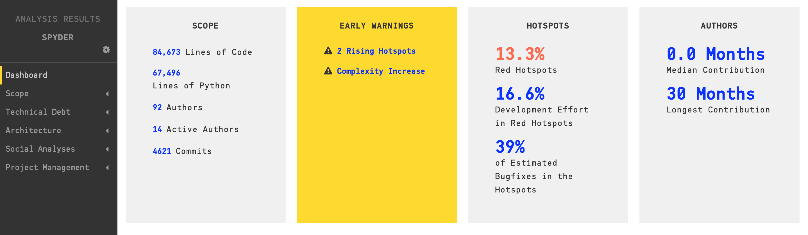
 
Spyder CodeScene Analysis Summary

#### Hotspots
Hotspots let a developer prioritize complicated code that they have to work with often and it shows where the most development time is spent as a percentage, and what percentages of bug fixes occur in those hotspots. Hotspots are calculated based on the code complexity and change frequency of individual files. The code complexity is based on if the hotspot has to be changed together with several other modules if the hotspot affects many different developers on different teams if the hotspot is likely to be a coordination bottleneck for multiple developers. CodeScene estimates that Spyder has 13.3% red hotspots. The red hot spots are the ones prioritized by CodeScene, and their analysis indicates that developers should spend the most time improving those hotspots for the most return on their time investment:

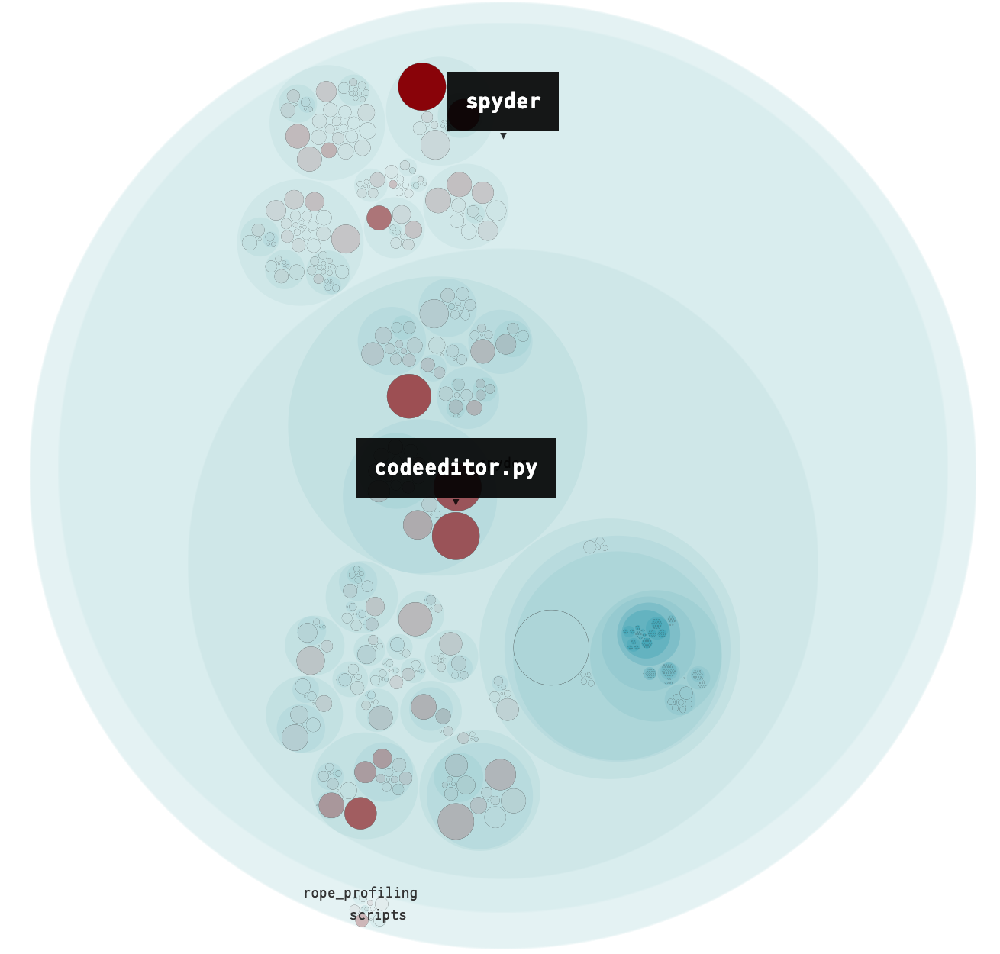
 
CodeScene Hotspots Overview

<!-- TODO add links to the files in the following paragraph (because they default to null web pages if they're not mentioned explicitly -->

It would appear that not all of the hotspots identified by CodeScene are of any consequence to our analysis of the technical debt of the project, at least in terms of how they relate to the Quality Attribute services identified by our team. The hotspots which appear to be relevant to our analysis occur in mainwindow.py, languageserver.py, editor.plugin.py, editor.widgets.editor.py, editor.widgets.codeeditor.py, and plugins.ipythonconsole.plugin.py. Interestingly, these modules happen to make up the bulk of which elements were present and relevant in our previous views from milestone 3 and 4. This would suggest that, since it would be beneficial for developers to focus on these modules, then they would directly affect the quality attributes identified by our team.

Refactoring targets are used to prioritize the hotspots and to make it happen CodeScene employs algorithms that look at deeper change patterns in the analysis data. Refactoring targets shows all the main files which are more prone to tehnical debt, in the below figure we can see that CodeScene identifies mainwindow.py, editor.py, and codeeditor.py as being the most important refactoring targets:

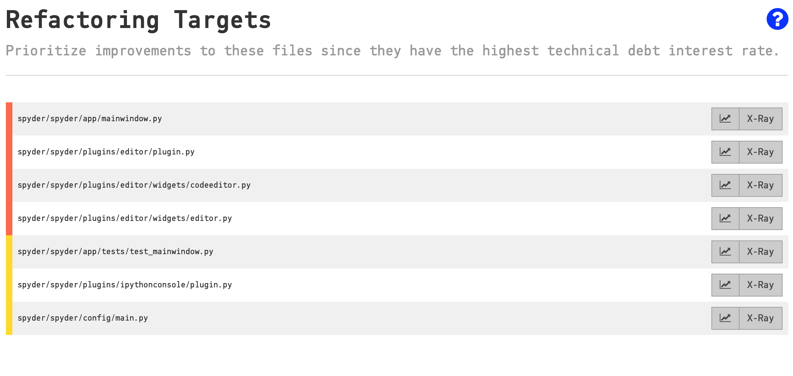
 
CodeScene Refactoring Targets

#### Temporal Coupling
The temporal coupling analysis shows how two files change together over time. This means that during the editing of two files, they are committed to a repository within the same commit, or commits within a short period of time. These files are frequently seen to change together, indicating that they might be dependent on each other. The temporal coupling can be a serious code smell and can be useful to identify code duplication or tight coupling. That is, if two modules are interdependent, which is an unwanted attribute, temporal coupling information offers at least some insight into this. Not surprisingly, Spyder appears to have low temporal coupling. With regards to the relevant quality attributes discussed in previous milestones, it would appear that temporal couplings are nearly non-existent. The only relevant couplings have a degree of temporal coupling rated at 30%. This is between the editor and it's plugin class, editor.py:

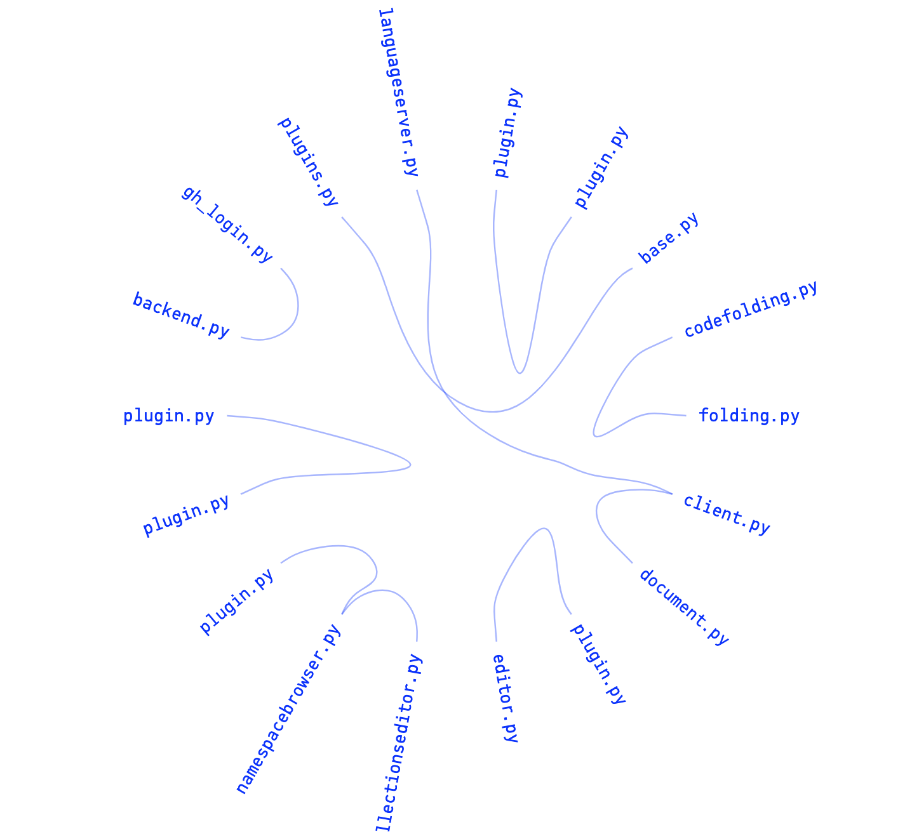 
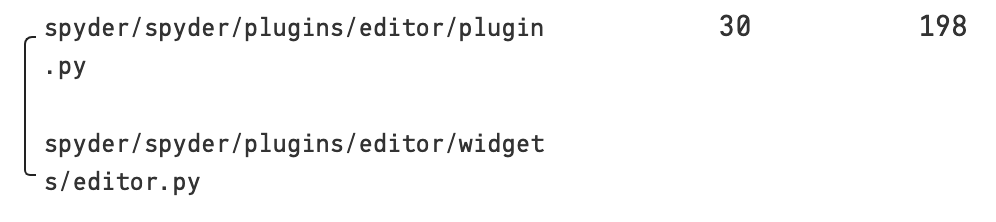
 
CodeScene Temporal Couplings Overview

### SonarQube
SonarQube serves a similar purpose as CodeScene, but it provides a little more information in a different way. Some of the information that SonarQube provides includes Bugs and Vulnerabilities, Code Smells, and Duplication. *SonarQube is an open-source platform developed by SonarSource for continuous inspection of code quality to perform automatic reviews with static analysis of code to detect bugs, code smells, and security vulnerabilities on 20+ programming languages. SonarQube offers reports on duplicated code, coding standards, unit tests, code coverage, code complexity, comments, bugs, and security vulnerabilities* [3].

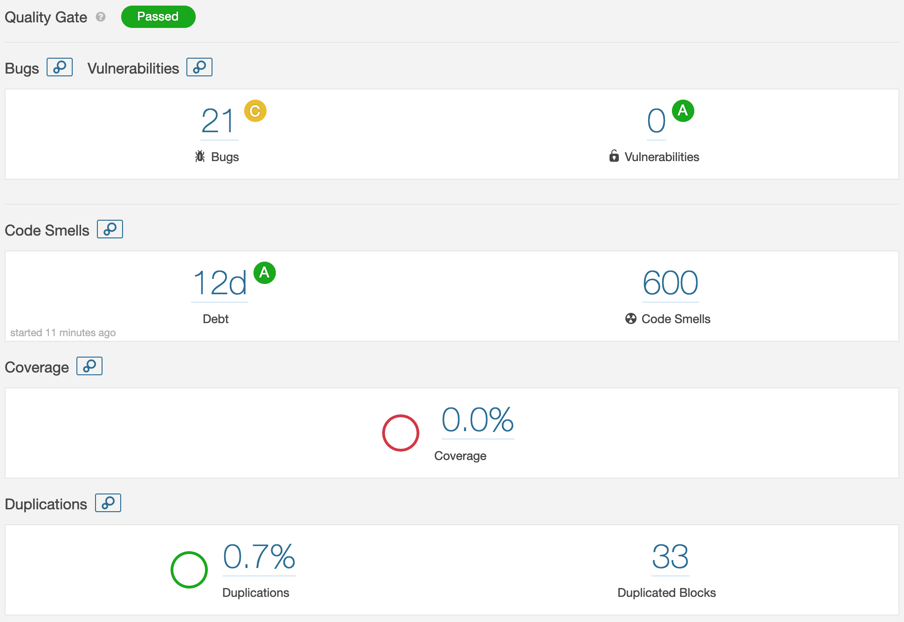
 
Spyder SonarQube Analysis Summary

#### Bugs and Vulnerabilities
Bugs are basically the error, flaw, failure or fault in a computer program or system that causes it to produce an incorrect or unexpected result, or to behave in unintended ways. 

The vulnerability is a weakness which can be exploited by a threat actor, such as an attacker, to perform unauthorized actions within a computer system. 

SonarQube defines a bug as *An issue that represents something wrong in the code. If this has not broken yet, it will, and probably at the worst possible moment. This needs to be fixed. Yesterday.*[2]

The SonarQube analysis found 21 bugs and zero vulnerabilities. All but two of the bugs were classified as "major". Two were classified as minor bugs. None of the bugs listed by the analysis was present in any module that was related to the relevant quality attribute scenarios. Of all bugs found only 10 were present in Python or Javascript files. The majority of major bugs were found in the file jquery.js which is a Javascript element in the Spyder "Help" plugin. Spyder is written primarily in Python but does use Javascript in some of its modules. The remainder were HTML bugs that appear to be less of a concern than the core code since Spyder is a desktop application, not a web-based one:

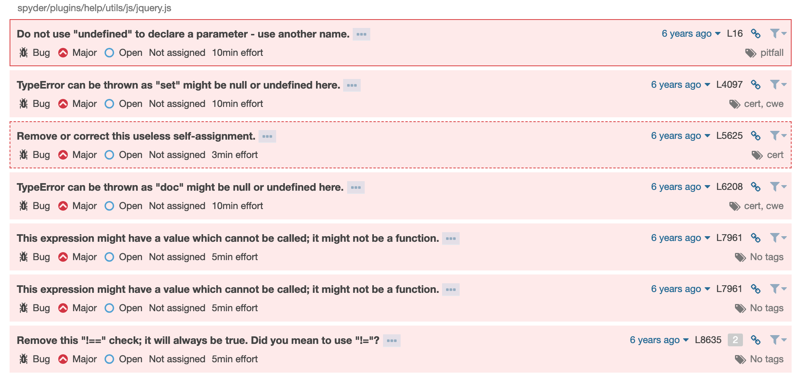
 
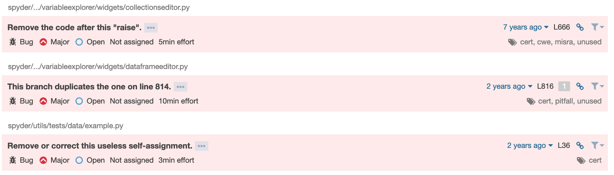
 
SonarQube relevant bug list

#### Code Smells
SonarQube defined a code smell as *A maintainability-related issue in the code. Leaving it as-is means that at best maintainers will have a harder time than they should make changes to the code. At worst, they'll be so confused by the state of the code that they'll introduce additional errors as they make changes.*[2]. The result of the analysis reveals 600 code smells in total. Of these 600 code smells, 150 were critical, 233 were major, and 217 were minor classifications. An example of a major code smell classification very common in the Spyder code base is "*Refactor this function to reduce its Cognitive Complexity from 87 to the 15 allowed*". Cognitive complexity is a scoring system based on what SonarQube considers to be a characteristic of code that contributes in some small way to the overall complexity of a code file. For example, nesting a piece of code contributes +1 points to the complexity and each subsequent nesting within a nesting contributes +1 points as well. Instances of triple (or more) nesting are penalized even more. Deep nesting is considered by SonarQube to be undesirable coding practice. Another example of a code smell present in Spyder is exceeding the limit of the number of function parameters. The default analysis settings for SonarQube is 7 function parameters maximum, and many functions exceed this limit. There are too many types of code smells to summarize in this report, suffice to say that the estimated accumulated days of effort needed to refactor all of the suggested issues is 12 days.

#### Duplication
Code duplication is generally regarded as an undesirable characteristic in a coding project. Code duplication means that, if the block of code duplicated has bugs, code smells, or technical debt, then the duplication of that code inherits all negative aspects, hence the undesirability. The SonarQube tool has identified approximately 0.7% of code duplication within the project, spread across 673 lines of duplicated code, 33 duplicated blocks, and 20 duplicated files. It should be noted that the modules with the largest proportion of duplication are the testing modules:

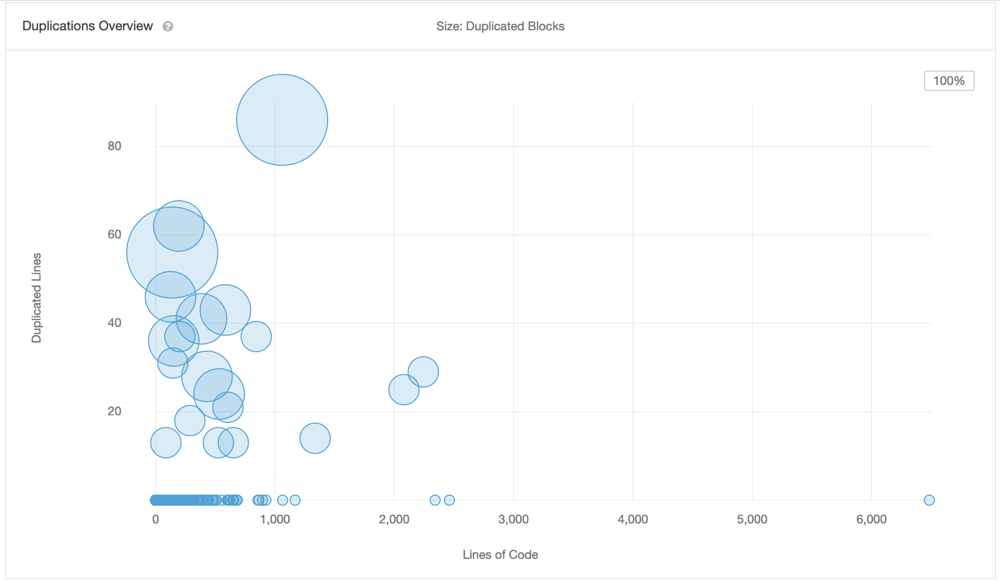
 
SonarQube code duplication overview

---

## Technical Debt Report

### Search for keywords in Github and Issues

We searched for "TODO" commenting in the Spyder code and noted the following distinct sections where it appeared that a "quick and dirty" implementation was being used rather than a proper implementation.

Here we see a comment, *This may be inefficient, find a faster way to do it*, indicating a solution that is likely to be slow, and could be replaced with a faster solution. Clearly, this code works for the overall solution for Spyder, but it becomes a processing bottleneck in the future. This is only a small trade-off, but it will lead to an accumulation of technical debt over time:

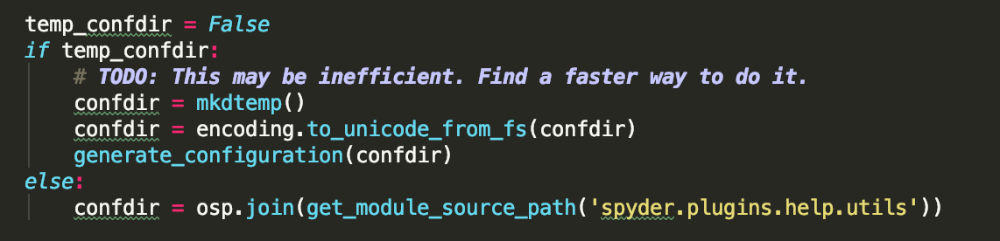
 
Code screenshot for sphinxify class level function in sphinxify.py

The comment *Remove hard coded "Value" column number (3 here)* indicates that the function in this class cannot be dynamic according to passed in parameters. If many hardcoded values are utilized throughout the code in a similar manner then bugs may arise, leading to the requirement for future refactoring in order to make the column numbers parameterized. Hard coding parameters leads to a small accumulation of technical debt:

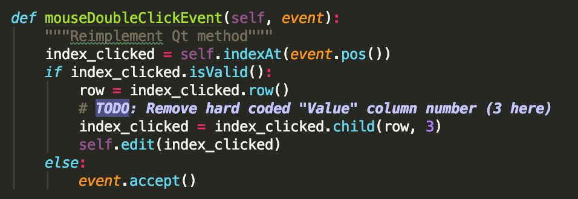
 
Code screenshot for CollectionsEditor class function: mouseDoubleClickEvent

We see a comment, *Add fallback to OSX* as a TODO item within the code base. This suggests that the developer either did not have time to implement the fallback to OSX within the logical flow of the function, or they simply forgot to do so. If it was the first case, then the design decision for this portion indicates the accumulation of technical debt. This is because the developer may have been looking for a fast solution likely to work on whatever operating system the function was being developed on, but the design of that function for cross-platform compatibility was deferred:

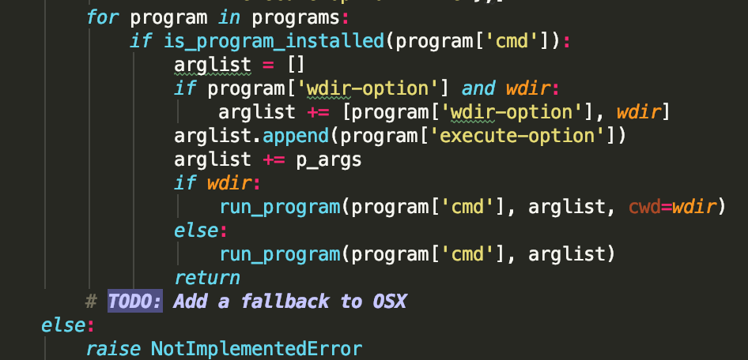
 
Code screenshot for ProgramError class function: todo_run_python_script_in_terminal

Of note, there are many comments "TODO: Connect this to the LSP!" within the Spyder code base in many plugin widget classes (the Language Server Protocol server provides Intellisense functionality). While some of these widgets do successfully connect to the LSP, some do not. Interestingly, recent bugs have arisen within the Spyder Github Issues forum mentioning that language recognition is not working on the SplitPane editor. We can see that technical debt is catching up to the recent versions of Spyder due to not implementing the LSP connections in all locations where there was a TODO comment:

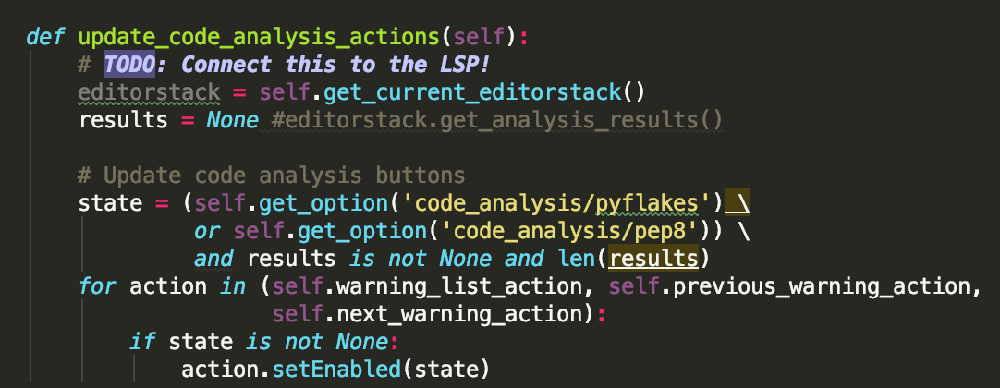
 
Code screenshot for Editor class function: update_code_analysis_actions

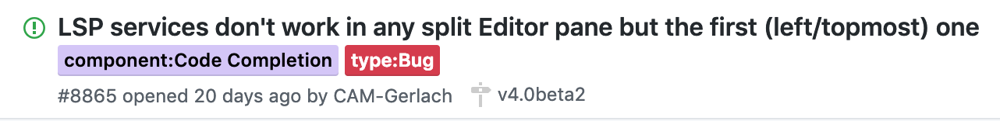
 
Technical debt issue relating Issues forum and codebase TODO comment

A keyword search for "technical debt" in the Issues section of the Spyder Github page revealed an open issue which was a discussion about a roadmap to end support for Python 2 in future releases of Spyder due to a number of reasons including: 

>*python2.7 support will end in 2020, some libraries are dropping python2 support (ipython), the majority of libraries already support Python 3, there is a big **technical debt** in spyder related to python2 support (the utility py3compat is used in +50 files), and the CI time will drop to almost half*.

The response of the lead maintainer, Carlos Cardoba, confirmed that Spyder 5 will indeed be a Python 3 project, and acknowledged that the port will be a big job:

> *The problem is the big refactoring we're planning for Spyder 4 (and that now lives in the split-plugins branch) will make really, really hard to keep maintaining our 3 series with bugfixes until 2020. So we decided to leave Python 2 support in Spyder 4 and to release Spyder 5 at the end of 2019 with the single change of being Python 3 only.*

The Spyder team has utilized Python 2 will the pycompat3 library up until now, but has made a decision to switch gears and move into Python 3 only support for a future version of Spyder (version 5) in 2020. This is a near textbook definition of technical debt. At the time Spyder was first released, it is possible that discussions about implementation in Python 2 were a non-issue because most external tools and libraries still used and supported Python 2. However, the clock is running down for Python 2 as it will no longer be supported in 2020. In addition, many of Spyder external modules are also dropping support for Python 2. A search in the Issues forums and discussion does not reveal the design decision for choosing Python 2 over 3 since 3 has been available since 2000 and Spyder development began around 2015. It is likely that the developers of Spyder in its early days did not consider their decision would result in an entire refactoring of the project at a later date. Either that or the refactoring was considered as a distinct possibility and the decision to use Python 2 was a conscious one so that a working version of the product could be implemented fast and with a lot of support from Python 2 only external modules. This is a typical example of a technical debt decision; *a design or construction approach is taken that's expedient in the short term, but that creates a technical context that increases complexity and cost in the long term*. Clearly, it is a complex task to refactor all Python 2 modules into Python 3 within a 200,000 KSLOC project, and the cost is certainly a factor.

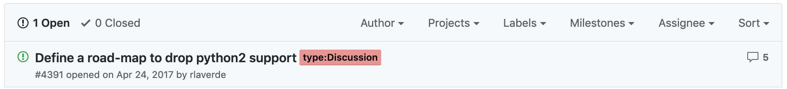
 
Technical debt issue about dropping Python 2 Support

### Summary of Findings

#### CodeScene Analysis
It would appear that the only issues of interest identified in the CodeScene analysis were the identification of hotspots within Spyder. The temporal coupling data revealed only a small amount of coupling within modules of interest (those related to the identified quality attribute scenarios). However, the hotspots suggest a high degree of complexity in almost all of the modules of interest. This suggests that these modules need to be refactored, at least in a general sense, to reduce code complexity. That is, the functions should be shorter, with less nesting in order to increase readability and maintainability. Because of the high complexity in the modules of interest, the primary quality attributes which we identified as important will be directly affected in the future.

#### SonarQube Analysis
From the bugs and vulnerabilities analysis, the most significant bug was a duplicated *else if* condition in the Spyder IDE Variable Explorer. Most likely, this bug leads to dead code, but there's a chance it could lead to unexpected behavior. The remaining bugs are within HTML files which seem inconsequential (since Spyder is a desktop application, not a web application), and within the Help plugin where there are a few items of the issue, but these bugs are within an arguably less important module. There are undoubtedly some code quality issues due to the bugs and vulnerability analysis.

There are a significant number of code smells within this project which sums to 12 days worth of refactoring. While these code smells are not necessarily project breaking issues, they are (by SonarQube's estimation) bad coding practice, and they should be refactored. Deeply nested functions, too many parameters, function length (too many lines), excessively large complexity scores, and other issues plague this project. 

The duplications are clearly an issue if the duplicated code itself has an inherent bug. If that's the case, then all of the duplicated bugs needed to be fixed.

All of these issues aren't mission critical to Spyder's success or failure, but over time these refactoring issues could lead to a stall in development when maintainability becomes too cost-intensive because the complexity is too much for developer maintenance.

#### Technical Debt
The code analysis tools estimated approximately 12 days of technical debt, or time required, in order to refactor the Spyder codebase into a form free of excessive complexity and code smells. The most interesting part of the technical debt analysis was derived from a manual check of the *issues* forum on the Spyder GitHub page. A number of issues were identified, but two were quite notable. The first of these issues was related to a bug where the Intellisense feature was not present on one of the Spyder widgets. This was due to an LSP (language server protocol) server bug. The LSP bug might have been predicted after a manual search through the code base for comments matching *TODO* since this search revealed many locations that put off connecting the LSP server to that portion of the code. The second notable issue had to do with a major design decision to migrate the entire Spyder code base from Python 2 to Python 3 in the 2019 release of Spyder version 5. This is certainly a potentially huge undertaking for the developer community since this is an open source project. Many of the developers may not be available or interested in contributing anymore, which leaves the original members (such as Carlos Cardoba and others) the sole responsibility of refactoring the entire project in a reasonable amount of time. The refactoring process may or may not have been predicted in the early days of the design of Spyder, but either way, it was undoubtedly a design decision which will have a significant impact on future project development. The second example is nearly a textbook definition of technical debt; it would seem that a major decision was made to use Python 2, possibly due to the availability of external modules that also used Python 2, in order to expedite the implementation of a working product. The tradeoff was a working product, but now the team faces paying the price by refactoring the entire code base.

### Other Notable Design Flaws
There is an inconsistent level of commenting throughout classes and functions. Some classes are commented quite extensively, but some are completely devoid of any comments. While some developers might argue that commenting is not necessary if functions and variables are named correctly, commenting does have it's place. Especially for new developers, or for speeding up the onboarding process for experienced developers who are new to the team. In addition, if there does not exist documentation for a project, a well-commented project can contribute to the accuracy of these documents by leaving less room for ambiguity or inaccurate interpretation of function or class behavior.

Some of the class files are 3 KSLOC which can be quite difficult to maintain or to determine the function of the class. Many of the classes are quite complex, as noted by a high level of complexity reported by CodeScene. This complexity is certainly palpable when attempting to intuit what the code actually does. In addition, there does not appear to be a code quality standard or style guide. Because of that, it seems that, as long as the code works, then style or complexity isn't a big deal. This causes an issue during the end to end function tracing, especially if some classes are over-engineered, and some are not, but both come from different developers.

### Conclusion
The Spyder project certainly has it's issues. The behavior of the product, when installed and used in a normal fashion, suggests a stable and well-engineered product. However, an analysis of the code base using both automated tools, and a manual analysis reveals a significant amount of technical debt, and overly complicated code. These issues could be addressed by creating a coding style guideline, as well as a guideline for project contribution. It might also be helpful to run the automated tools on a regular basis in order to double check that the design is not going too far off the rails. While many issues can be addressed and prevented, some technical debt cannot be avoided.

---

## References

[1] https://codescene.io/about  
[2] https://docs.sonarqube.org/latest/user-guide/concepts/  
[3] https://en.wikipedia.org/wiki/SonarQube
