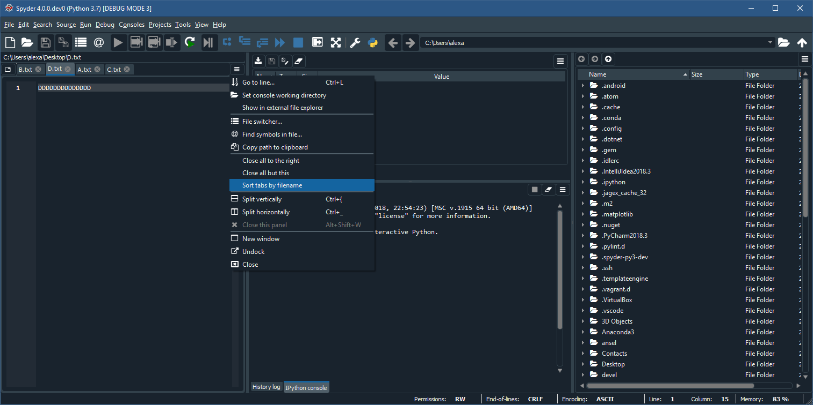
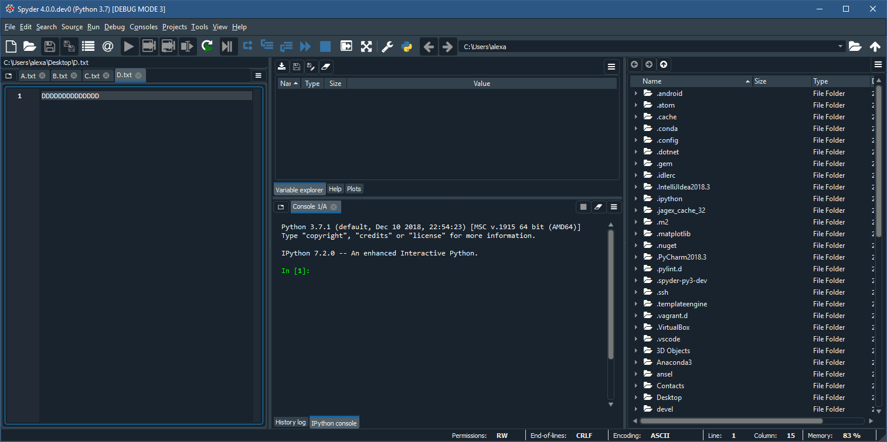

# Milestone 7

## Group Members
1. Arman Yousef Zadeh Shooshtari
2. Anna Olkhovskaia
3. Zoë Henderson
4. Alex Deweert
5. Nitika Jindal

[Pull Request](https://github.com/spyder-ide/spyder/pull/9109)

This pull requests adds a GUI feature to the Spyder IDE. Since the Spyder IDE is primarily feature based, it is assumed that a utility based feature that contributes to the overall functionality of the application is welcome. The utility feature added was a menu item that performs a lexographical sorting of the tabs of the main Editor window of Spyder. Most developers have experienced a time during the use of an IDE where multiple open tabs can become overwhelming and disorganized. By sorting the tabs by filename, navigation of these tabs becomes easier since the feature facilitates visual searching (or manual tabbing over) by lexographical order.

The feature sorts the tabs and maintains their file contents, and does not change file focus. For example, if a user is looking at file A.txt, and does a sort, the position of A.txt's tab may change, but the file remains open, its contents are still in view, and the tab remains selected.

 
Menu item added

 
Result of the sort

